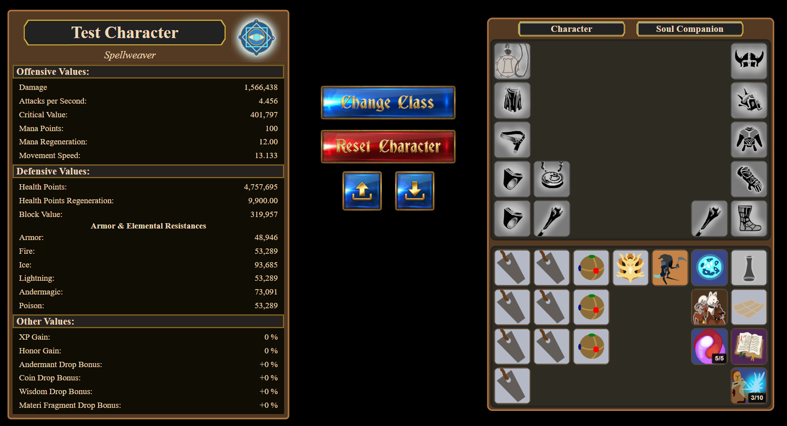
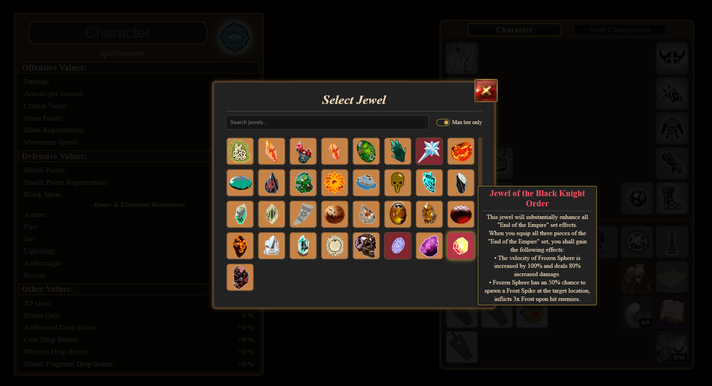
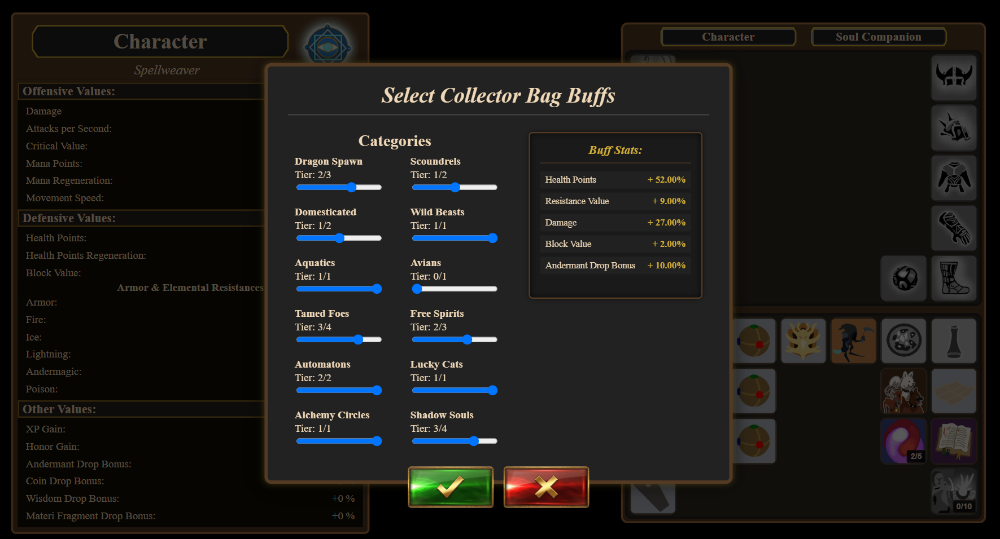

# DSOBuildSim

Full-stack application for simulating and calculating complex, rule-based character statistics for **Drakensang Online**.

DSOBuildSim allows users to configure characters using equipment, enhancements, pets, buffs and other game systems and see the resulting character statistics.

The application consists of a **Spring Boot backend** providing the calculation engine and REST API, and an **Angular frontend** for interactive build configuration and visualization.

>**Current development:** The frontend is currently being developed on the `milestone-3-frontend` branch.
>The `master` branch currently contains the Spring Boot backend and REST API.
>The current frontend implementation is available on [`milestone-3-frontend`](../../tree/milestone-3-frontend).
>

**Technologies:** Java, Spring Boot, REST API, Angular, TypeScript

---

## Screenshots

### Character Overview



### Jewel Selection



### Collector's Bag



Additional screenshots and feature documentation can be found in the [`docs`](docs/) directory.

---

## Features

- Interactive character build configuration
- REST API for calculating character statistics
- Rule-based processing of complex game mechanics
- Automatic handling of interactions such as set bonuses and modifiers
- Modular stat calculation engine
- Equipment and inventory management
- Jewel/Rune/Dragonstone and enhancement configuration
- Collector's bag configuration

**Domain entities include:**
- Items (types: unique, mythic, sets)
- Enhancements (gems, runes, jewels)
- Additional modifiers (pets, buffs, essences)
- Skill trees and other character systems

---

## Architecture

The project follows a **backend + frontend architecture**.

```
DSOBuildSim
├── backend   # Spring Boot REST API
└── frontend  # Angular web application (planned)
```

### Backend Architecture

The backend follows a layered architecture:

- **Controller layer** (REST endpoints)  
- **Service layer** (business logic)  
- **Domain model** (entities and rule system)  

The stat calculation is implemented as a modular system where different components contribute to the final result.

---

### Backend Tech Stack

- Java
- Spring Boot
- REST API
- Maven
- JSON-based data definitions
- JUnit / Mockito

---

### Frontend

- Character configuration
- Equipment and item selection (wip)
- Jewel/Rune/Dragonstone trinkets
- Jewel/Rune/Dragonstone selection and filtering
- Collector bag buffs
- Character statistics

---

### Frontend Tech Stack

- Angular
- TypeScript
- HTML / SCSS
- npm

---

## How It Works

1. The frontend requests game data definitions from the backend  
2. The user selects items, enhancements and modifiers  
3. The frontend sends the configuration to the backend  
4. The backend calculates and returns the resulting stats
5. The displayed stats are updated with the freshly calculated stats

---

## API Overview

### Get Game Data

```
GET /api/game-data
```

Returns all available definitions (items, gems, runes, pets, etc.).

---

### Calculate Character Stats

```
POST /api/stats/calculate
```

Calculates final character stats based on the provided configuration.

### Example Request

```json
{
  "characterClass": "SPELLWEAVER",
  "items": {
    "BOOTS": {
      "itemType": "WINTER_BOOTS",
      "level": 145,
      "gems": [
        { "gemType": "ONYX", "tier": 17 }
      ]
    }
  },
  "pet": {
    "petType": "DRAGON_CAT",
    "tier": 5
  }
}
```

Note: The actual request structure is significantly more complex and includes many additional systems (e.g. runes, jewels, buffs, skill trees). The example above is simplified for readability.

### Example Response

```json
{
  "stats": {
    "DAMAGE": 1504828.10,
    "CRIT_VALUE": 401796.79,
    "ATTACK_SPEED": 4.46,
    "HEALTH_POINTS": 4463101.28,
    "ARMOR_VALUE": 48945.96,
    "BLOCK_VALUE": 319956.94,
    "MOVEMENT_SPEED": 13.13
  }
}
```

Note: The actual response includes more stats. The example above is simplified for readability.

---

## Testing

- Unit tests for core calculation logic  
- Focus on correctness of stat computation and rule interactions  

---

## Running the Project

### Backend

**Requirements:**
- Java 17+
- Maven  

**Run:**
```
mvn spring-boot:run
```

The REST API will start locally.

---

### Frontend (planned)

**Requirements:**
- Node.js  
- Angular CLI  

**Run:**
```
npm install
ng serve
```

---

## Purpose

This project was developed to practice building structured backend systems with non-trivial business logic and to improve skills in API design and clean architecture.

Additionally, it can be used as a tool for experimenting with different character configurations.

---

## Roadmap
 
- Item filtering
- PvP Mode
- Build sharing  
- Detailed stat breakdown  
- Support for additional systems  

---

## License

This project is licensed under the MIT License.

---

## Disclaimer

This project is a fan-made tool and is not affiliated with or endorsed by Bigpoint or Drakensang Online.
